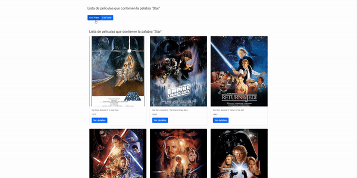
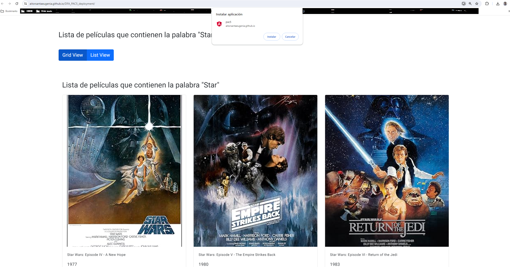

## PAC nº #5 Desarrollo frontend avanzado - Máster Desarrollo de Aplicaciones y sitios web

### Rutas al proyecto
🔗*Github Pages*🔗-> https://aitorsantaeugenia.github.io/DFA_PAC5_deployment/ <br>
🔗*Netlify*🔗-> https://dfa-pac5.netlify.app/

### API utilizada
- Hemos decidido utilizar una *API* de películas llamada https://www.omdbapi.com/ (ya he usado *TMDB API* https://developer.themoviedb.org/reference/intro/getting-started anteriormente, así que he decido usar esta que és algo diferente).
- Requiere de una llave para ser usada (1 min. registro).
- Al haber millones de películas, hemos abreviado con https://www.omdbapi.com/?s=star&apikey=5d8ee22f ; así solo aparecen unas 10 películas que contienen la palabra "*Star*".
- Dejo mi *API key* por si el profesorado la ha de utilizar: 5d8ee22f (no la usaré más, y sé que esto no se debería hacer).

### Ejercicio 1: Implementación PWA
<code>Componentes creados</code>
- En el enunciado se dice que cómo mínimo se han de utilizar dos componentes: <ins>*component-list*</ins> y <ins>*component-detail*</ins>. Luego, posteriormente se habla de dos componentes base (*card* y *grid*).
- Así pues, en nuestro caso lo que hemos hecho és omitir el **component-list** y que este sea <ins>*card.component*</ins> (el *home* principal), dónde dependiendo del botón a clicar, mostremos este componente *card* o el otro componente *grid* (llamado <ins>*grid.component*</ins>).

<div align="center">

<p><i>Preview global de la PWA</i></p>
</div>

<code>Spinner</code>

- El *spinner* lo hemos agregado en cualquier llamada a la *API*. Tanto en la página <ins>*home*</ins>, cómo cuándo carga el componente <ins>*grid*</ins> (al cambiar la vista de *card* a *grid*), así cómo cuándo carga <ins>*la página de detalle*</ins>.
- Tanto en la <ins>página detalle</ins> cómo en el <ins>home</ins> se aprecia si miramos con atención, por ellos, en el código se incluye un **setTimeOut()** de *1s* comentado, si se descomenta se puede observar mejor el *spinner*.
- Hemos usado un *spinner* de **Angular Material**

```ts
import { MatProgressSpinnerModule } from '@angular/material/progress-spinner';
```

<code>Animación</code>

- Se ha copiado el *CSS* de **animate.css** en <ins>**/src/assets/css/animate.css**</ins>.
- Se ha agregado <ins>**fadeIn**</ins> tanto en el home al cargar los dos componentes (*grid* o *card*) así cómo en el *detail*.

```html
<div class="card text-center animate__animated animate__https" style="width: 50%;">
```

<code>Navegación página detalle</code>
- Accesible desde los dos componentes, *grid* y *card*.

<div align="center">

<p><i>Navegación de card o grid a detail</i></p>
</div>

<code>Página detalle</code>

- Realizado bajo el nombre de **detail.component**
- Se muestra <ins>título</ins>, <ins>director</ins> y la <ins>imagen</ins>.
- El botón <ins>*back*</ins> esta implementado (botón de *bootstrap*) a la derecha.
- Se ha creado un <ins>*expansion panel*</ins> de *Angular Material*, para mostrar el resto de propiedades de las películas.

```ts
import { MatExpansionModule } from '@angular/material/expansion';
```

<div align="center">

<p><i>Implementación de la página detalle</i></p>
</div>

<code>Configuración del service worker</code>

- En el archivo <ins>*ngsw-config.json*</ins> se ha agregado lo siguiente:

```json
"dataGroups": [
    {
      "name": "movies-api",
      "urls": [
        "http://www.omdbapi.com/**"
      ],
      "cacheConfig": {
        "maxSize": 10,
        "maxAge": "1h",
        "timeout": "1s",
        "strategy": "freshness"
      }
    }
  ]
```

- También se ha agregado la ruta de *bootstrap*:

```json
"urls": ["https://cdn.jsdelivr.net/npm/bootstrap@5.0.2/dist/css/bootstrap.min.css"]
```

- Podemos ver a continuación, si accedemos a los <ins>DevTools</ins> de *Chrome* y hacemos *check* a las opciones *sin conexión* o *actualizar sin volver a cargar*, que sin tener conexión a *Internet*, podremos ver las imágenes igualmente.

<div align="center">

<p><i>Página detalle y el service worker</i></p>
</div>

###  Ejercicio 2: Deployment
<code>Deployment en Github Pages</code><br><br>
🔗*Github Pages*🔗-> https://aitorsantaeugenia.github.io/DFA_PAC5_deployment/
- Hemos seguido la documentación https://v17.angular.io/guide/deployment, ya que *Angular 15* no tiene *index.html* para *Github* *Pages* así que te mostraria el *README.md* al hacer la *build* si lo haces cómo en el temario. Los cambios son los siguientes:
    - Una vez creas el repositorio y subes todos los documentos.
    - *git checkout -b gh-pages*
    - *ng build --output-path docs --base-href /your_project_name/* (siendo */your_project_name/* el nombre del repositorio de *Github*, en mi caso *DFA_PAC5_deployment*).
    - Esto te crea la carpeta */docs*, entonces se ha de entrar en dicha carpeta copiar el *index.html* y llamar a la copia *404.html*.
    - Hacemos *commit* y *push* de los cambios.
    - En *Github*, en tu repostorio, vamos a *Settings* > *Pages* > *Deploy* from *branch* y seleccionamos *gh-pages* y el directorio */docs*.
- Con esto tendremos el deployment hecho en *Github Pages*.

🚨🚨- <ins>*Git bash* en *Windows*</ins>: Dato curioso, *ng build --output-path docs --base-href /your_project_name/* da error con las rutas ya que *Git bash* las toma absolutas en lugar de relativas. Así que mejor usar *Windows Powershell*, *Anaconda Prompt* o cualquier otra. <br> https://stackoverflow.com/questions/59341718/not-allowed-to-load-local-resource-error-on-chrome-angular-app-is-not-running

<div align="center">

<p><i>Deployment en Github Pages</i></p>
</div>

<code>Deployment en Netlify</code>

- Hacemos login con Github
- En *Sites* le damos a <ins>*Add new site*</ins> y seleccionamos *Github* para que aparezcan nuestros repositorios. En caso de que no aparezca el repositorio de *Github* que quieras, te dará la opción de acceder a *Github* y elegir el repositorio en cuestión deseado para el *deployment*.
- Seleccionamos en nuestro caso <ins>*DFA-PAC5-deployment*</ins> y en las opciones, ponemos que se realice el *deploy* de la rama *main*, el comando para realizar la build será <ins>*ng build --configuration production*</ins> y el directorio a publicar será <ins>*dist/pac5*</ins>.
- Le damos a *deploy* y una vez finalice sino hay problemas, podremos ver nuestra web en: 
https://dfa-pac5.netlify.app/

<div align="center">

<p><i>Deployment en Netlify</i></p>
</div>

<code>Verificación de PWA - Instalación en los deploys</code>

<div align="center">

<p><i>Verificación de que funciona cómo PWA en Github Pages</i></p>
</div>

<div align="center">

<p><i>Verificación de que funciona cómo PWA en Netlify</i></p>
</div>

<br><hr><br>
<div align="center">
    <code>BY-NC-SA @</code> <a href="https://github.com/AitorSantaeugenia">Aitor J. Santaeugenia Marí</a>
</div>